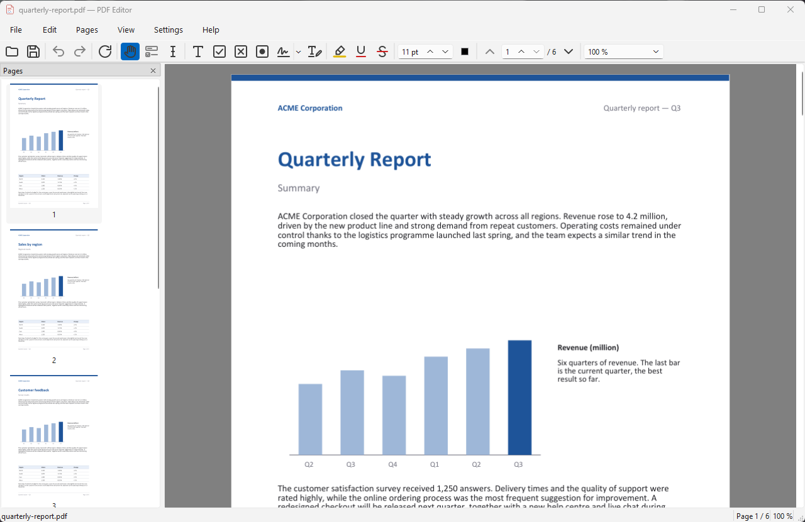
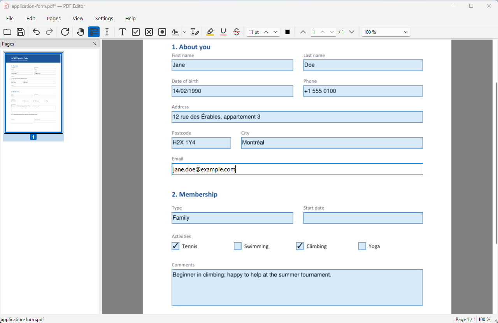
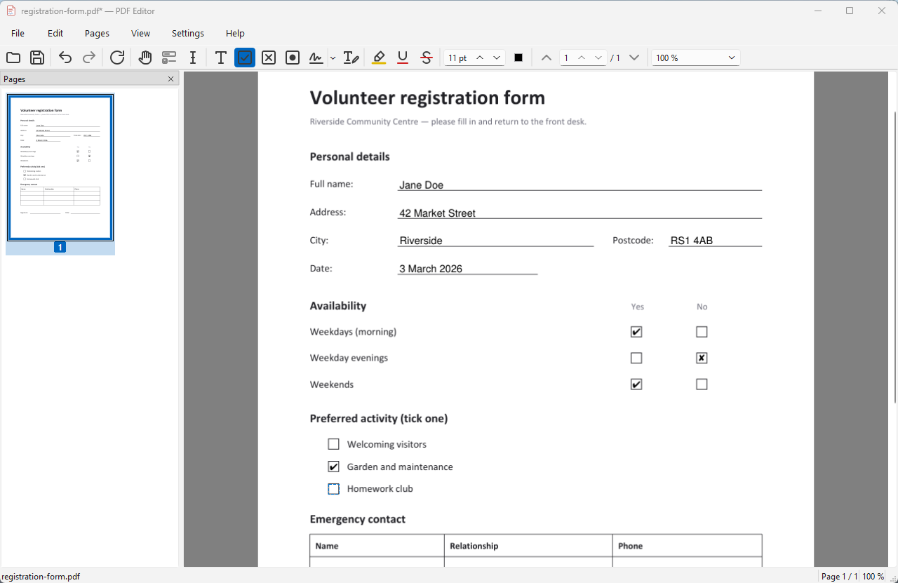
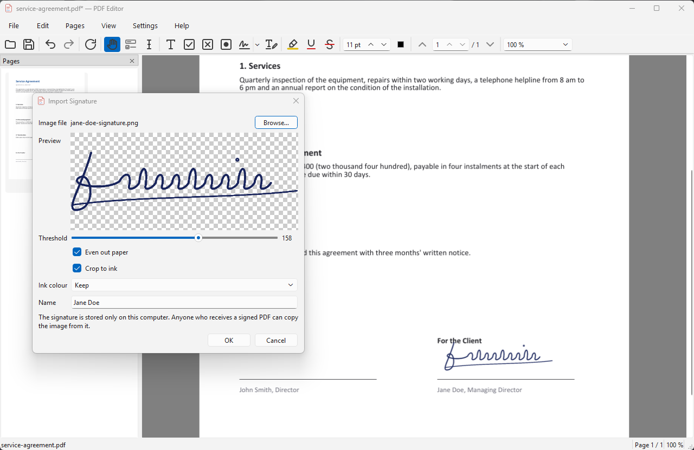
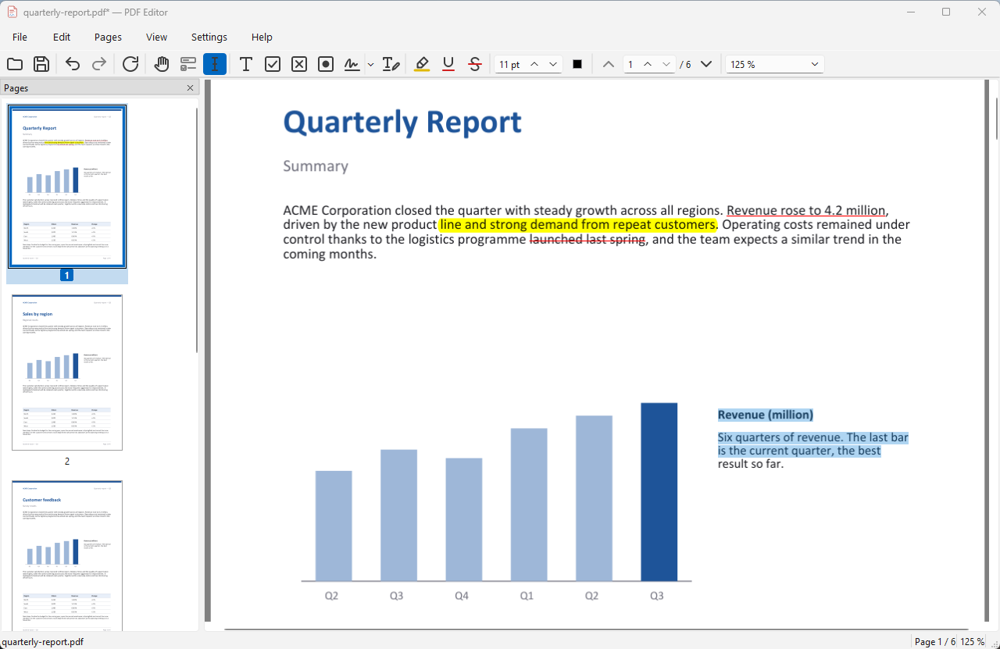
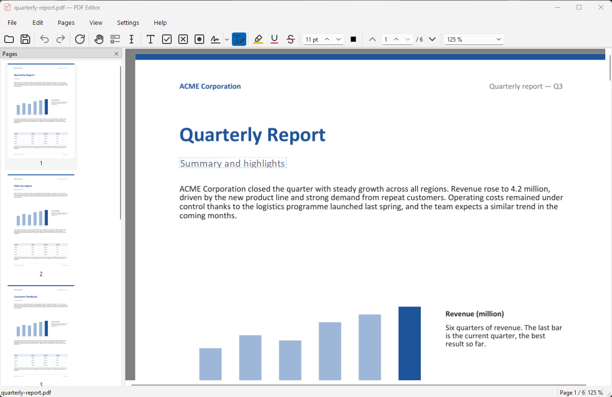
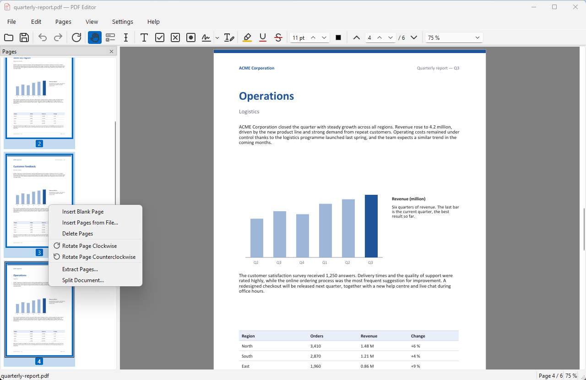
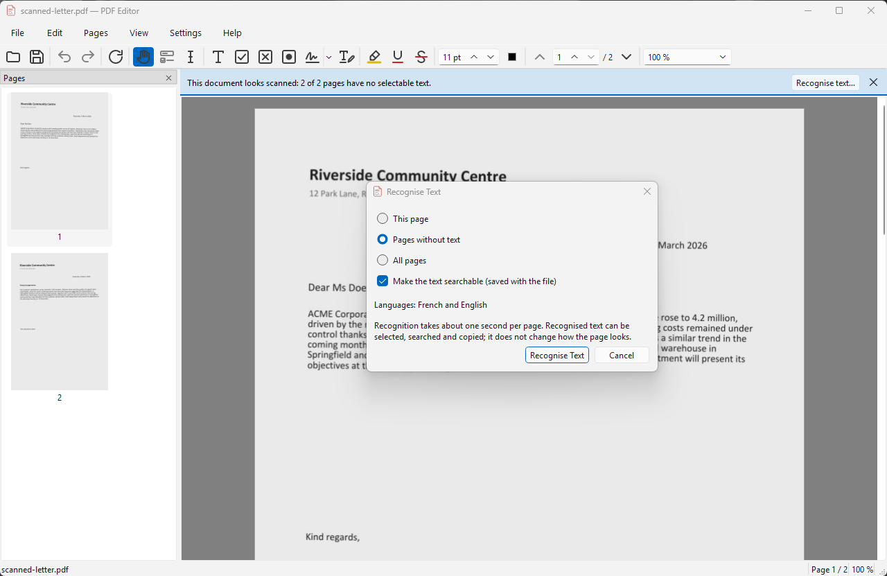
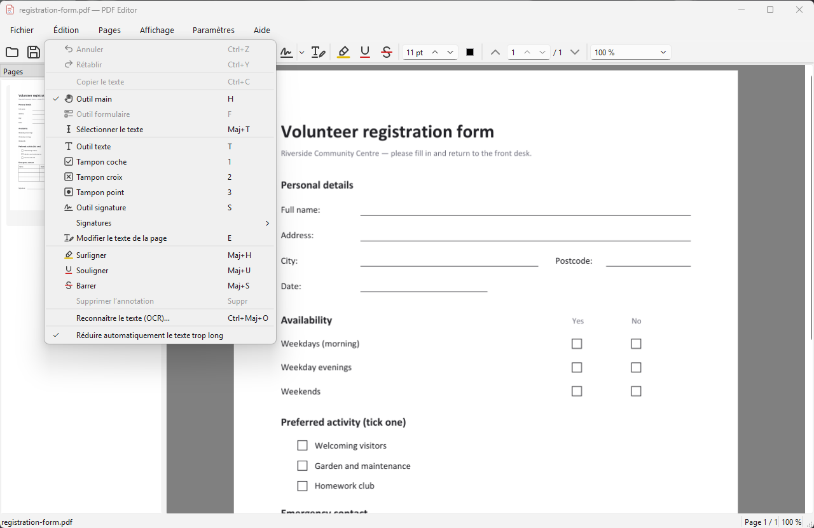

# PDF Editor

**Fill, sign, annotate and fix PDF files on Windows — free, offline, in English or French.**

*[Version française](README.fr.md)*

[**Download the latest version**](https://github.com/cor3nt1nn/pdf-editor/releases/latest) ·
[Release notes](https://github.com/cor3nt1nn/pdf-editor/releases) ·
[Report a problem](https://github.com/cor3nt1nn/pdf-editor/issues)

## Features

- **Fill PDF forms** — text fields, checkboxes, radio buttons and drop-down lists, with Tab
  to go from one field to the next.
- **Write on flat forms** — Word exports, printed or scanned forms: type text anywhere and
  tick boxes with ✓ ✗ ● stamps. Text and stamps snap to table cells, underlines and
  checkboxes, even on scans.
- **Sign with a photo of your signature** — photograph or scan it once; the paper
  background is removed and the signature is kept on your computer, ready to place on any
  page.
- **Highlight, underline, strike through** and **copy text** from the page.
- **Edit the page's own text** — fix a typo, a name or a date in place, in the document's
  font.
- **Page tools** — reorder pages by dragging thumbnails, delete, rotate, insert blank pages
  or pages from another PDF, extract pages, split a document.
- **Recognise text in scans (OCR)** — make scanned pages searchable and selectable, in
  French and English, without any internet connection.
- **Export a copy** — flatten form fields, text, stamps and signatures into the page, and
  leave out earlier versions, hidden data and document properties.
- Everything can be undone (Ctrl+Z / Ctrl+Y). Other PDF readers (Adobe Acrobat Reader,
  Edge, Chrome) show and print what you add.
- **English or French** interface, light or dark (follows Windows).

## Download and install

Requires Windows 10 or 11 (64-bit). Both downloads are on the
[latest Release](https://github.com/cor3nt1nn/pdf-editor/releases/latest).

### Setup program (recommended)

1. Download `PDFEditor-<version>-setup.exe`.
2. Run it. The program is not signed, so Windows SmartScreen may say "Windows protected your
   PC": click **More info ▸ Run anyway**.
3. Choose the language, accept the licence and keep **Install for me only** (no
   administrator rights needed). "Install for all users" asks for administrator rights.
4. Optional: a desktop shortcut, and **Add PDF Editor to the "Open with" list of PDF files**.
   The setup never changes your default PDF program; to make PDF Editor the default, choose
   it in Windows **Settings ▸ Apps ▸ Default apps**.
5. Start **PDF Editor** from the Start menu.

**Upgrade:** run the setup of the newer version. It offers to close PDF Editor if it is
open, and keeps your settings and saved signatures.

**Uninstall:** Windows **Settings ▸ Apps ▸ Installed apps ▸ PDF Editor ▸ Uninstall**. You
are then asked whether to also delete your settings, saved signatures and log files
(default: keep them).

### Portable version (zip)

No installation — runs from any folder, for example a USB stick.

1. Download `PDFEditor-<version>-win64.zip` and extract it: you get a `PDFEditor` folder.
2. Run `PDFEditor.exe` in that folder (SmartScreen: **More info ▸ Run anyway**, the first
   time only).
3. Optional: **Settings ▸ Register with Windows (Open with)…** adds PDF Editor to the "Open
   with" list of PDF files. If you move the folder later, register again from the new place.

To remove it: **Settings ▸ Unregister from Windows** (if you registered it), then delete the
folder.

### Where your data is kept

Both versions share the same data:

- settings: `%APPDATA%\PDFEditor\PDFEditor.ini`
- saved signatures: `%LOCALAPPDATA%\PDFEditor\PDFEditor\signatures`
- log file: `%LOCALAPPDATA%\PDFEditor\PDFEditor\logs\pdfeditor.log` (also shown in
  **Help ▸ About PDF Editor…**)

To remove everything by hand, delete `%APPDATA%\PDFEditor` and `%LOCALAPPDATA%\PDFEditor`.

## How to use

Open a file with **File ▸ Open** (Ctrl+O), by dragging it onto the window, or with "Open
with" in Windows Explorer. **Ctrl+S** saves; **Help ▸ Keyboard Shortcuts…** (F1) lists every
shortcut.

### Fill a form

A PDF with fillable fields opens with the **Form Tool** (F) active and its fields tinted blue
(**View ▸ Highlight Form Fields** turns the tint off).

- Click a text field and type; **Enter** validates (Ctrl+Enter in a multi-line field),
  **Esc** cancels.
- Click checkboxes and radio buttons to tick them (or **Space**); pick values in drop-down
  lists.
- **Tab** / **Shift+Tab** go to the next / previous field, in reading order.
- A value too long for its box is written smaller so it fits (**Edit ▸ Auto-shrink
  Overflowing Text**).

Some forms made with Adobe LiveCycle ("dynamic XFA", often showing "Please wait…") cannot be
filled here: a banner explains how to print them to PDF and fill the printed copy instead.

### Write on a flat form

For documents without fillable fields (Word exports, printed or scanned forms):

- **Text Tool** (T): click and type. **Ctrl+Enter** or a click elsewhere validates — a click
  in the next cell starts the next text box at once. Inside a table cell the text starts at
  the cell's edge; on a "Name: ______" line it sits on the line. A dashed preview shows
  where it will go.
- **Stamps**: **1** ✓ check mark, **2** ✗ cross, **3** ● dot. Clicking in a checkbox centres
  the stamp and sizes it to the box.
- Hold **Alt** while clicking to place exactly at the pointer, without snapping.
- Click a text or stamp to select it, drag to move it, drag a handle to resize it,
  double-click a text to edit it, **Delete** to remove it. The toolbar's size box and colour
  button change the selected text.

### Sign

1. **Signatures ▸ Add Signature…** (or press **S** the first time): choose a photo or scan of
   your handwritten signature. Adjust **Threshold** until the strokes are complete and the
   paper is clean; **Even out paper** removes shadows, **Crop to ink** trims the margins,
   **Ink colour** can force black or blue. Give it a name.
2. With the **Signature Tool** (S), click in the signature box or on the signature line: the
   signature is placed and sized to fit. Elsewhere, click to centre it or drag to choose its
   width.
3. Move or resize it like a text box. **Signatures ▸ Manage Signatures…** renames or deletes
   saved signatures.

This is a picture of your signature, not a certified digital signature.

### Highlight and copy text

- **Select Text** (Shift+T): drag over text, double-click a word, triple-click a line, then
  **Ctrl+C**.
- **Highlight** (Shift+H), **Underline** (Shift+U), **Strike Through** (Shift+S): drag over
  the text and release.
- Click a markup to select it: the colour button recolours it, **Delete** removes it, Ctrl+C
  copies its text.

### Edit the page's text

**Edit Page Text** (E): click a word (double-click selects the whole part of the line in one
style), press **Enter** or **F2**, type the new text, press **Enter**. **Esc** cancels. The
document's own font is used when it has the letters you type; otherwise a matching installed
font is used and the status bar tells you.

### Manage pages

Use the **Pages** menu, or right-click thumbnails in the sidebar (**F4** shows or hides it).
**Ctrl+click** / **Shift+click** select several pages; drag thumbnails to reorder; **Delete**
removes the selected pages. Every page operation can be undone.

- Insert a blank page (Ctrl+Shift+N) or pages from another PDF (Ctrl+Shift+I, all pages or a
  range such as `1-3, 7, 10-`).
- Rotate (Ctrl+R / Ctrl+Shift+R), delete (Ctrl+Shift+Delete), extract to a new file
  (Ctrl+Shift+E).
- **Pages ▸ Split Document…** cuts the document every *N* pages or by ranges.

### Recognise text in a scan (OCR)

When a document looks scanned, a banner offers **Recognise text…**; you can also use
**Edit ▸ Recognise Text (OCR)…** (Ctrl+Shift+O). Choose the pages and keep **Make the text
searchable** checked: the recognised words are added invisibly over the image, so the page
looks the same but can be searched, selected, copied and highlighted. It takes about a second
per page; **Cancel** keeps the pages already done. Everything stays on your computer.

Turn sideways pages upright (Ctrl+R) before recognising them.

### Export a copy

**File ▸ Export Copy…** (Ctrl+E) writes a new file and leaves the open document unchanged:

- **Flatten form fields** and **Flatten text, stamps and signatures** turn them into part of
  the page, so they can no longer be changed;
- the copy never contains earlier saved versions (for example a signature you deleted), and
  you can leave out the document properties.

Use it before sending a signed or filled document.

### Keyboard shortcuts

| Keys | Action |
|---|---|
| Ctrl+O / Ctrl+S / Ctrl+Shift+S | Open / Save / Save As |
| Ctrl+E | Export Copy |
| Ctrl+W / Ctrl+Q | Close document / Quit |
| Ctrl+Z / Ctrl+Y | Undo / Redo |
| H / F / T | Hand tool / Form Tool / Text Tool |
| 1 / 2 / 3 | ✓ / ✗ / ● stamp |
| S | Signature Tool |
| E | Edit Page Text |
| Shift+T | Select Text |
| Shift+H / Shift+U / Shift+S | Highlight / Underline / Strike Through |
| Ctrl+C | Copy text |
| Delete | Delete the selected item (or the selected pages in the sidebar) |
| Alt + click | Place without snapping |
| Ctrl+Enter | Validate the text being typed |
| Ctrl+R / Ctrl+Shift+R | Rotate pages clockwise / counterclockwise |
| Ctrl+Shift+N / Ctrl+Shift+I | Insert blank page / pages from a file |
| Ctrl+Shift+Delete / Ctrl+Shift+E | Delete pages / Extract pages |
| Ctrl+Shift+O | Recognise text (OCR) |
| Ctrl++ / Ctrl+- / Ctrl+0 | Zoom in / out / 100 % |
| Ctrl+1 / Ctrl+2 | Fit width / Fit page |
| Ctrl + mouse wheel | Zoom under the pointer |
| F4 | Show / hide page thumbnails |
| F1 | Keyboard shortcuts |

## Screenshots

| | |
|---|---|
| **Fill PDF forms**  | **Fill flat forms**  |
| **Sign with an image**  | **Highlight, underline, strike through**  |
| **Edit the page's own text**  | **Organise pages**  |
| **Recognise text in scans (OCR)**  | **English or French**  |

## Known limitations

- Windows only.
- Signatures are images of your handwriting, not certified digital signatures.
- Dynamic XFA forms (Adobe LiveCycle) cannot be filled; print them to PDF first.
- Text boxes use Helvetica only (no bold, italic or alignment). Characters outside Western
  European alphabets may not display in form fields and text boxes.
- Comb fields (one letter per box) are filled as plain text; list boxes allow one choice.
- Page text editing changes one line in one style at a time and does not re-flow
  paragraphs; when the document's font lacks a letter, a similar installed font is used.
- OCR reads French and English only, does not detect page orientation, and works best on
  clean 200–300 dpi scans (about 9 words out of 10); handwriting is not recognised.
- Saving keeps earlier versions inside the file. To be sure removed content (such as a
  deleted signature) is gone for good, use **File ▸ Save As…** or **File ▸ Export Copy…**.
- Page labels (i, ii, 1, 2…) are not renumbered after moving or deleting pages, and
  bookmarks to deleted pages are kept.

## Licence

PDF Editor is free software under the [GNU Affero General Public License v3.0](LICENSE).
It includes third-party components listed in
[THIRD_PARTY_LICENSES.md](THIRD_PARTY_LICENSES.md) (also in **Help ▸ Third-Party
Licenses…**).

## Report a problem

Open an [issue](https://github.com/cor3nt1nn/pdf-editor/issues) describing what you did and
what happened. Attaching the log file (its location is shown in **Help ▸ About PDF
Editor…**) helps a lot.
